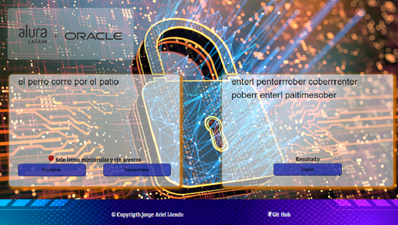

# _Encriptador de texto - Challenge Alura Latam y Oracle_

  

<h2>Introduccion</h2>

  

    Este es un challenge para poner en practica los conocimientos adquiridos en el curso de "Principiante de programación",
    utilizando: <strong>HTML, CSS y JAVASCRIPT.</strong>
  

**El mismo consiste en crear una página web que contenga dos cuadro de texto: donde en el primero se ingrese un mensaje para poder ser encriptado ó desencriptado
    según sea lo que se necesite, debajo de este cuadro debe haber dos botones uno para encriptar y el otro para desencriptar; en el segundo cuadro se debe visualizar
    el resultado del proceso de encriptado ó desencriptado, y debajo tener un botón para copiar este resultado(el mismo es opcional).**
    

  

  

